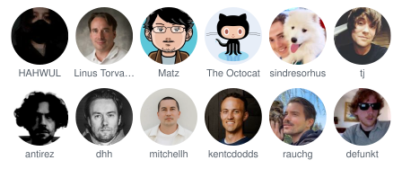
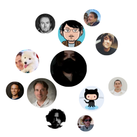
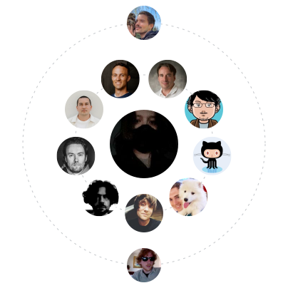
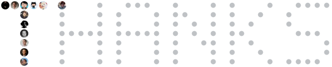

# contributor-mural

Paint a mural of the people who make your project happen. Ships as a GitHub Action (written in [Crystal](https://crystal-lang.org)) that renders your list of users, your contributors, or both into embeddable SVG art and commits it to your repository.

| Grid | Honeycomb | Mosaic |
| :--: | :-------: | :----: |
|  |  |  |

| Spiral | Orbit | Voronoi |
| :----: | :---: | :-----: |
|  |  |  |

| Stencil |
| :-----: |
|  |

*(Curated samples from [`examples/showcase.yml`](examples/showcase.yml). This repository also runs the action on itself every week — the live result lands in [`docs/`](docs/).)*

- **Seven styles** — a classic grid (circle/rounded/square), honeycomb hexagons, a weight-tiered mosaic, a golden-angle spiral, an orbit with your lead contributor at its centre, a stained-glass voronoi, and a stencil that spells a word out of faces.
- **Many sources, one mural** — your curated `users` list, repository contributors, org members, stargazers, and GitHub Sponsors (tier amounts become weights). Write a source to enable it; everything merges, and your YAML entries always win.
- **Sections & roles** — split the mural into titled groups (say, *Contributors* and *Special Thanks*) and tag people with a role line (*Creator*, *Design*, *Docs*) — made for honoring the folks the contributors API can't see.
- **Adapts to GitHub dark mode** — by default the SVG carries both palettes and follows the viewer's theme. Pick a `preset` (`github`, `midnight`, `paper`, `mono`) or tune every color for light and dark separately.
- **SVG and PNG** — self-contained SVGs (avatars embedded as base64, so they render inside READMEs) plus rasterized PNGs for places SVG can't go, including light/dark pairs.
- **Local avatars** — point `avatar_url` at a file in your repository for logos or people without a GitHub account.

## Quick start

Create `.github/contributor-mural.yml`:

```yaml
# List the sources you want — writing one is what turns it on.
contributors:             # this repository's contributors

users:                    # plus anyone the API cannot see
  - login: hahwul
    name: HAHWUL
    role: Creator

exclude:
  - dependabot[bot]
```

The smallest useful config is one line: `contributors:` on its own.

Add a workflow, e.g. `.github/workflows/contributor-mural.yml`:

```yaml
name: Contributor Mural
on:
  workflow_dispatch:
  schedule:
    - cron: "0 3 * * 0"

permissions:
  contents: write

concurrency:
  group: contributor-mural

jobs:
  generate:
    runs-on: ubuntu-latest
    steps:
      - uses: actions/checkout@v5
      - uses: crystal-actions/contributor-mural@v1
```

Then embed the result in your README:

```markdown

```

## Action inputs

| Input | Default | Description |
| ----- | ------- | ----------- |
| `config` | `.github/contributor-mural.yml` | Path to the config YAML, relative to the repository root |
| `token` | `${{ github.token }}` | GitHub API token. Required for `sponsors`; also lifts rate limits and reaches private repos for the other API sources |
| `no_commit` | `false` | Generate files but skip commit/push (must be `true` or `false`) |
| `commit_message` | `chore: update contributor mural` | Commit message |

Outputs: `paths` (comma-separated generated files, SVG and PNG), `user_count`, and `changed` (whether a commit was pushed; `false` when `no_commit` is set). `svg_path` still works as an alias for `paths`.

## Configuration

Everything about the art lives in the config YAML:

```yaml
style: grid                 # grid | honeycomb | mosaic | spiral | orbit | voronoi | stencil
output: CONTRIBUTOR_MURAL.svg    # path relative to the repository root

# --- Sources: write a block to enable it; results are merged ---

users:                      # your curated list
  - login: hahwul           # required — GitHub login
    name: HAHWUL            # optional display name (default: login)
    weight: 10              # optional, drives mosaic sizing + weight sort
    role: Creator           # optional label under the name (grid) / in tooltips
    group: Contributors     # optional section this user renders in
    link: https://hahwul.com          # optional (default: the GitHub profile)
    avatar_url: https://…/custom.png  # optional override; also accepts a
                                      # repo-relative file (assets/logo.png)

groups: [Contributors, Special Thanks]  # optional: section order (and typo guard)

contributors:               # this repository's contributors (all fields optional)
  repo: owner/name          # default: the current repository
  include_bots: false       # keep type=Bot / *[bot] accounts
  include_anonymous: false  # include anonymous (email-only) contributors
  max: 100                  # cap fetched contributors; contributions become weight
  group: Contributors       # optional section for API-fetched users

members:                    # organization members (`org` is required)
  org: crystal-actions
  max: 100
  group: Team

stargazers:                 # the repository's stargazers
  repo: owner/name          # default: the current repository
  max: 100
  group: Stargazers

sponsors:                   # GitHub Sponsors (needs a token)
  login: hahwul             # default: the repository owner
  max: 100                  # tier $/month becomes each sponsor's weight
  group: Sponsors

# --- Everything below is presentation ---

exclude:                    # drop logins from any source
  - dependabot[bot]

sort: weight                # weight | login | none (none keeps list order)
limit: 60                   # cap rendered users after merge/sort
fail_on_missing: false      # true: fail the run when an avatar can't be fetched

outputs:                    # optional: render several files in one run
  - path: docs/wall-grid.svg
  - path: docs/wall-hex.svg
    style: honeycomb
  - path: docs/wall.png     # .png outputs are rasterized (see `png` below)
    mode: dark              # optional per-output light/dark override

grid:
  columns: 8
  avatar_size: 64
  shape: circle             # circle | rounded | square
  margin: 8
  show_names: true
  truncate: 12              # max name length (0 = no truncation)

honeycomb:
  columns: 9
  cell_size: 72
  gap: 4

mosaic:
  width: 800
  base_cell: 48
  tiers: [3, 2, 1]          # cell spans per weight tier (top tier first)
  gap: 2

spiral:                     # sunflower packing; rank sets size and distance
  max_size: 72              # the centre avatar
  min_size: 32              # the outermost ones
  gap: 6
  shape: circle             # circle | rounded | square

orbit:                      # one avatar at the centre, the rest in rings
  center_size: 104
  avatar_size: 56           # first ring; each ring out is a little smaller
  min_size: 36
  ring_gap: 22
  gap: 8
  rings: true               # draw the faint orbit lines

voronoi:                    # stained glass; cells tile the block edge to edge
  width: 720
  cell_size: 96             # target cell pitch, not a hard size
  gap: 4                    # the lead between cells — the page shows through
  jitter: 0.5               # 0 is a plain lattice, 0.8 is as loose as it gets
  weight_influence: 0.6     # 0..1, how much weight widens a cell
  outline: false            # hairline cell borders, for busy backgrounds

stencil:                    # avatars fill the pixels of a word
  text: THANKS              # A-Z, 0-9, space, and - . ! ? + ' ♥ (use "\n" for
                            # a second line; size the word to your crowd)
  pixel_size: 24            # one glyph pixel, and the avatar that fills it
  gap: 4
  letter_spacing: 1         # blank columns between glyphs, in glyph pixels
  line_gap: 1
  shape: circle             # circle | rounded | square
  ghosts: true              # faint dots on the pixels nobody has filled yet

theme:
  preset: github            # github | midnight | paper | mono
  mode: auto                # auto (follows the viewer's dark mode) | light | dark
  background: transparent   # light-palette overrides on top of the preset
  label_color: "#57606a"
  role_color: "#6e7781"     # the role line under names
  title_color: "#24292f"    # section titles
  dark:                     # dark-palette overrides
    label_color: "#8b949e"
  font_family: "-apple-system, 'Segoe UI', Helvetica, Arial, sans-serif"

png:
  scale: 2                  # rasterization zoom for .png outputs
```

When someone appears in both your `users` list and an API source, your entry wins field by field — set a custom `name` or `weight` while the contribution count fills everyone else's. Placement is always yours: an entry without `group` renders in the untitled leading section even if the API put that person in one, so add `group:` when you want them filed under a heading. Someone returned by more than one API source (a contributor who also sponsors) appears once, keeping the highest weight and the first source's group.

This is the recipe for honoring people the API misses — unlinked commit emails, design or docs work: add them to `users` with a `role` and their own section.

## Notes

- A config file is required; the action fails if `.github/contributor-mural.yml` (or the path you pass as `config`) does not exist.
- The workflow needs `permissions: contents: write` to push the generated file, and a `concurrency` group avoids racing pushes on busy repositories.
- Avatars link to profiles and carry name/role tooltips, but a README embed (``) renders as an ``, where neither is active. Open the SVG directly — or inline it — to get links.
- `members` returns public organization members only; a token with `read:org` is needed for the rest. Stargazers arrive oldest-first with no weight, so under the default `sort: weight` they trail contributors — use `sort: none` to keep the API order.
- On `pull_request` events the checkout is a detached HEAD, so pushes fail — use push/schedule/dispatch triggers, or set `no_commit: true` and handle the file yourself.
- SVG size grows with user count (roughly 5–15 KB per avatar). Use `limit` and moderate avatar sizes for large walls.
- With `mode: auto` (the default) the SVG contains both palettes and a `prefers-color-scheme` media query, so it follows GitHub's light/dark theme. PNGs can't adapt, so `.png` outputs pin `auto` to the light palette — add a second output with `mode: dark` for a pair.
- PNG output uses `rsvg-convert`, bundled in the action image. For local runs install librsvg (`brew install librsvg` / `apt install librsvg2-bin` / `apk add rsvg-convert`).
- `sponsors` always needs a `token` (GraphQL API); the default `github.token` works for public sponsor lists.

## CLI

The action binary is also a local CLI:

```bash
shards build --release
bin/contributor-mural --config examples/showcase.yml   # regenerates the committed examples/*.svg
bin/contributor-mural -c my.yml --commit               # opt in to commit/push locally
```

`--config` is resolved against the current directory, while output paths and local `avatar_url` files are resolved against `--workspace` (the current directory by default; `GITHUB_WORKSPACE` inside the action). Committing happens automatically when `GITHUB_ACTIONS=true` — including on runners that emulate it, such as act or Forgejo — and otherwise only with `--commit`.

## Development

```bash
shards install
crystal spec                    # unit + golden-file specs (no network)
UPDATE_GOLDEN=1 crystal spec    # regenerate golden SVGs after renderer changes
crystal tool format
bin/ameba src spec
```

Release flow: pushing a `vX.Y.Z` tag builds a multi-arch image to `ghcr.io/crystal-actions/contributor-mural` and force-moves the major tag (`v1`, `v2`, …). The image is pushed before the git tag moves, so the moving tag always references an existing image.

`action.yml` points at that published image, which is why consumers start in seconds rather than building Crystal on their runner. The CI job that runs the action rewrites `action.yml` back to `image: Dockerfile` first, so it tests the code under review instead of the last release.

## License

MIT — see [LICENSE](LICENSE).
